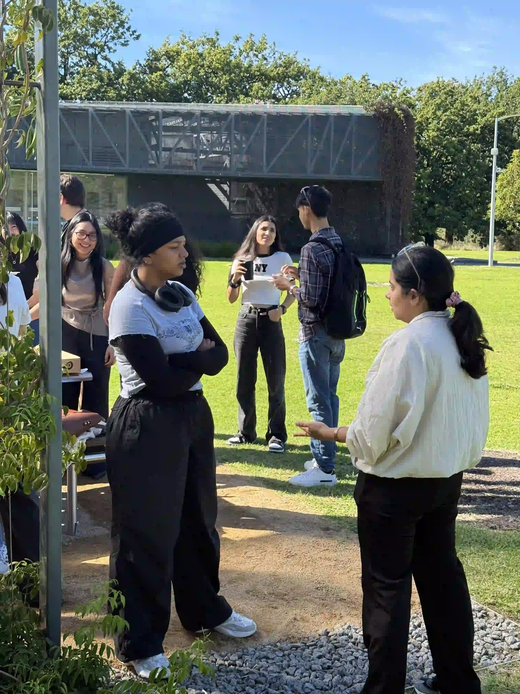
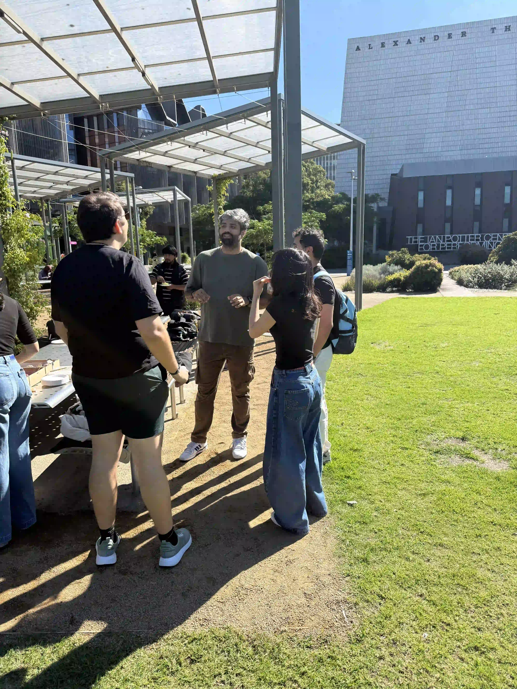
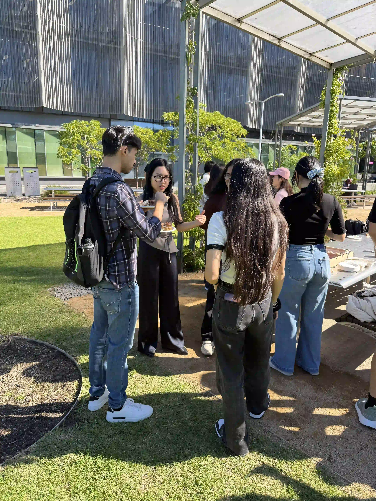
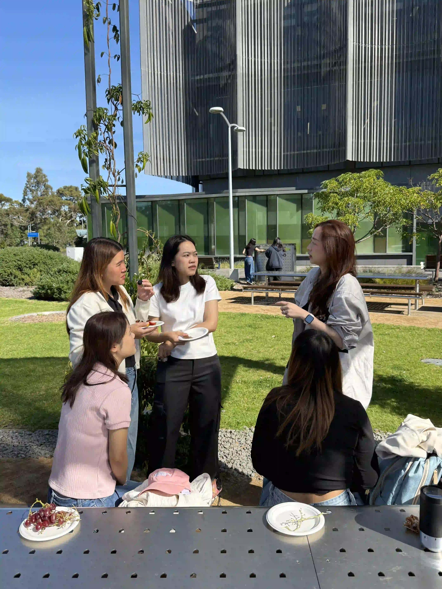
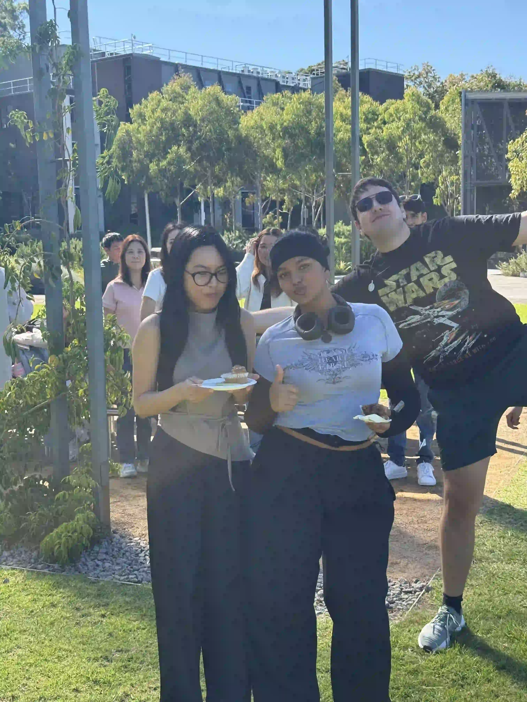
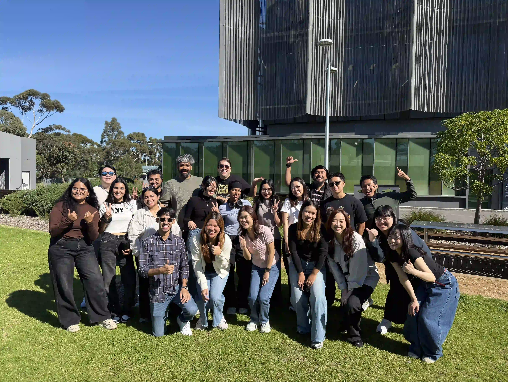
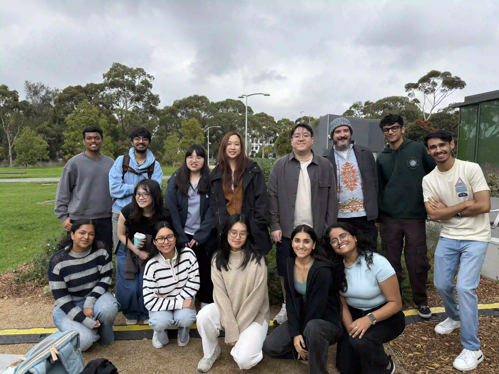

```{=html}
<section class="hero">        
        <!-- 1. Animated Tiled Background -->
        <div class="hero-bg">
            <div class="bg-track">
                <!-- Group 1 -->
                <div class="bg-grid">
                    
                    
                    
                    
                    
                    
                    
                    
                    
                    
                    
                    
                </div>
                <!-- Group 2 (Exact Duplicate for Seamless Looping) -->
                <div class="bg-grid">
                    
                    
                    
                    
                    
                    
                    
                    
                    
                    
                    
                    
                </div>
            </div>
        </div>

        <!-- 2. Transparent Fade Overlay -->
        <div class="hero-overlay"></div>

        <!-- 3. Foreground Content -->
        <div class="hero-content">
            <div class="h1-text">Welcome to the <span class="highlight">MBAT Club</span></div>
            <p class="logline">Connect, collaborate, and conquer your academic journey with a community that has your back.</p>
        </div>
    </section>
```

```{=html}
<!-- WIDGET HTML -->
<div class="event-widget">
  <div class="widget-header">
    <h2 class="widget-title">Upcoming Events</h2>
    <button class="btn" id="openCalendarBtn" onclick="location.replace('events.html')" >View Full Schedule</button>
  </div>
  
  <div class="events-grid" id="eventsContainer">
    <div class="loading">Loading upcoming events...</div>
  </div>
</div>
```



```{=html}
  <h2 class="anchored" data-anchor-id="connect-with-us">Connect with us</h2> 
<section id="connect-with-us" class="connect-section">
  <div class="discord-server-container">
    <a href="https://discord.gg/j7C7kGTXfJ" class="server-card-link" aria-label="Join MBAT Discord Server">
      <div class="server-card" id="server-card-1">
        
        <!-- Left: Animated Discord Icon -->
        <div class="server-card-icon">
          <svg viewBox="0 0 127.14 96.36" width="28" height="28" fill="currentColor">
            <path d="M107.7,8.07A105.15,105.15,0,0,0,81.47,0a72.06,72.06,0,0,0-3.36,6.83A97.68,97.68,0,0,0,49,6.83,72.37,72.37,0,0,0,45.64,0,105.89,105.89,0,0,0,19.39,8.09C2.79,32.65-1.71,56.6.54,80.21h0A105.73,105.73,0,0,0,32.71,96.36,77.7,77.7,0,0,0,39.6,85.25a68.42,68.42,0,0,1-10.85-5.18c.91-.66,1.8-1.34,2.66-2a75.57,75.57,0,0,0,64.32,0c.87.71,1.76,1.39,2.66,2a68.68,68.68,0,0,1-10.87,5.19,77,77,0,0,0,6.89,11.1A105.25,105.25,0,0,0,126.6,80.22h0C129.24,52.84,122.09,29.11,107.7,8.07ZM42.45,65.69C36.18,65.69,31,60,31,53s5-12.74,11.43-12.74S54,46,53.89,53,48.84,65.69,42.45,65.69Zm42.24,0C78.41,65.69,73.31,60,73.31,53s5-12.74,11.43-12.74S96.36,46,96.26,53,91.19,65.69,84.69,65.69Z"/>
          </svg>
        </div>
        
        <!-- Middle: Information -->
        <div class="server-card-content">
          <div class="server-name">MBAT</div>
          <p class="server-desc" id="server-desc-1">Want to connect outside class? <br/> Join our Discord server to chat, collaborate, and stay in the loop with fellow students and alumni.</p>
        </div>
        
        <!-- Right: Animated Stats Container -->
        <div class="server-card-stats">
          <!-- New Members Icon -->
<svg xmlns="http://www.w3.org/2000/svg" width="24" height="24" viewBox="0 0 24 24" fill="none" stroke="currentColor" stroke-width="2" stroke-linecap="round" stroke-linejoin="round" class="feather feather-users"><path d="M17 21v-2a4 4 0 0 0-4-4H5a4 4 0 0 0-4 4v2"/><circle cx="9" cy="7" r="4"/><path d="M23 21v-2a4 4 0 0 0-3-3.87"/><path d="M16 3.13a4 4 0 0 1 0 7.75"/></svg>
          <div> <span class="user-count" id="user-count-1">2</span><span> users</span> </div>
        </div>
        
      </div>
    </a>
  </div>
  <br/>
<div class="discord-join-section">
  <p class="discord-text">
    <strong>Excited to join in?</strong> 🚀<br>
    Submit a request to join the official Discord server below!
  </p>
  <a href="https://forms.gle/F8naqubjujRqYnN9A" class="discord-button" target="_blank" rel="noopener noreferrer">Request to Join</a>
</div>

</section>
<script>
  fetch("https://discord.com/api/invites/j7C7kGTXfJ")
    .then((resp) => {
    if(resp.ok) {
      return resp.json()
    } else {
    throw new Error("Discord server data broken")
    }
    })
    .then((json) => {
      document.querySelector("#user-count-1").innerHTML = json.profile.member_count
    })
</script>
```

## Resources

```{=html}
<div class="modern-resources-list">
  <!-- Have a question Card -->
  <a href="https://forms.gle/9Tmx25sxkJ6svSma8" class="resource-card" id="upcoming-events">
    <div class="resource-icon">
      <!-- Calendar SVG Icon -->
<svg xmlns="http://www.w3.org/2000/svg" width="24" height="24" viewBox="0 0 24 24" fill="none" stroke="currentColor" stroke-width="2" stroke-linecap="round" stroke-linejoin="round" class="feather feather-help-circle"><circle cx="12" cy="12" r="10"/><path d="M9.09 9a3 3 0 0 1 5.83 1c0 2-3 3-3 3"/><line x1="12" y1="17" x2="12.01" y2="17"/></svg>
    </div>
    <h4>Have a question?</h4>
    <p>If you have any question or feedback to give to us reach out to us below.</p>
    <span class="resource-btn">Reach Out to us</span>
  </a>

  <!-- Unit Guide Card -->
  <a href="course_map.html" class="resource-card" id="unit-guide">
    <div class="resource-icon">
      <!-- Map SVG Icon -->
      <svg width="28" height="28" fill="none" stroke="currentColor" stroke-width="2" viewBox="0 0 24 24">
        <path stroke-linecap="round" stroke-linejoin="round" d="M9 20l-5.447-2.724A1 1 0 013 16.382V5.618a1 1 0 011.447-.894L9 7m0 13l6-3m-6 3V7m6 10l4.553 2.276A1 1 0 0021 18.382V7.618a1 1 0 00-.553-.894L15 4m0 13V4m0 0L9 7"></path>
      </svg>
    </div>
    <h4>Unit Guide</h4>
    <p>Planning your pathway? See how each unit connects and discover the study route that works best for you using our detailed course map.</p>
    <span class="resource-btn">View Course Map</span>
  </a>
</div>
```
